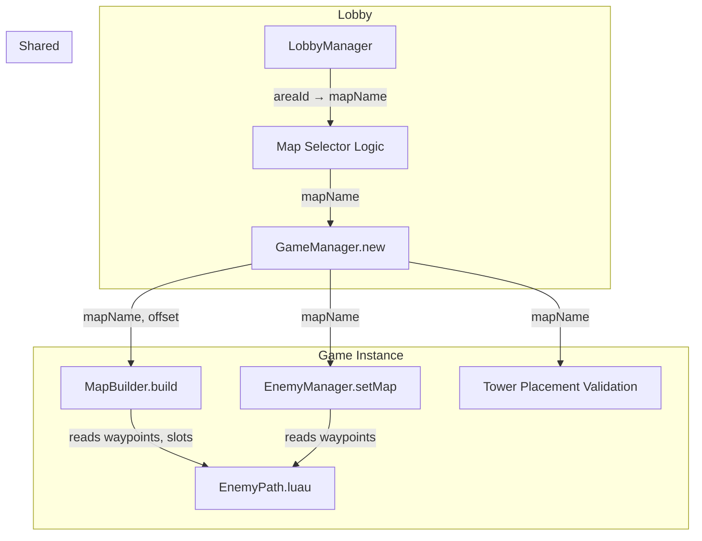

# Design Document: Multi-Map System

## Overview

The Multi-Map System connects each lobby pad to a specific map, replacing the hardcoded "Map1" in GameManager. Pad 1 launches Greenfield, Pad 2 launches Dustlands, and Pad 3 picks a random map. The system also upgrades MapBuilder to produce terrain with elevation variation and decorative elements themed per map, redesigns EnemyPath waypoints to include U-turns for strategic turret placement, and isolates each game instance's map visuals into a unique folder so concurrent games don't collide.

Changes touch five modules:
- **EnemyPath.luau** (shared) — redesigned waypoints with U-turns, new `getMapNames()` already exists
- **MapBuilder.luau** (server) — terrain generation with hills, decorations, per-map themes, unique folder names
- **GameManager.luau** (server) — accepts `mapName` parameter, passes it to EnemyManager/MapBuilder, cleans up per-instance visuals
- **LobbyManager.luau** (server) — pad-to-map mapping, random selection for Pad 3, sign label updates, passes map name to GameManager
- **EnemyManager.luau** (server) — already supports `setMap(name)`, no structural changes needed

## Architecture



### Data Flow

1. **Pad Selection**: Player steps on pad → LobbyManager determines map name from `PAD_MAP_ASSIGNMENTS` table (Pad 1 = "Map1", Pad 2 = "Map2", Pad 3 = random via `EnemyPath.getMapNames()`).

2. **Game Launch**: LobbyManager calls `GameManager.new(players, areaId, loadouts, mapName)` → GameManager stores `mapName` → `init()` calls `EnemyManager.setMap(mapName)`, `MapBuilder.build(mapName, worldOffset, areaId)`.

3. **Map Building**: MapBuilder creates folder `"MapVisuals_" .. areaId` → generates terrain grid with elevation variation → builds path tiles at Y=0 → places themed decorations → builds tower slots and boundaries.

4. **Cleanup**: `GameManager.stop()` destroys `workspace:FindFirstChild("MapVisuals_" .. areaId)`.

## Components and Interfaces

### LobbyManager Changes

```lua
-- New: pad-to-map assignment table
local PAD_MAP_ASSIGNMENTS = {
    [1] = "Map1",   -- Greenfield
    [2] = "Map2",   -- Dustlands
    [3] = "RANDOM", -- resolved at launch time
}

-- New: resolve map name for an area
local function resolveMapName(areaIndex: number): string
    local assignment = PAD_MAP_ASSIGNMENTS[areaIndex]
    if assignment == "RANDOM" then
        local allMaps = EnemyPath.getMapNames()
        return allMaps[math.random(1, #allMaps)]
    end
    return assignment
end
```

Sign labels updated from `"Area " .. i` to include map names:
- Pad 1: `"Greenfield"`
- Pad 2: `"Dustlands"`
- Pad 3: `"Random"`

`launchGame()` calls `resolveMapName(areaIndex)` and passes result to `GameManager.new()`. For Pad 3, the resolved map name is broadcast to occupants via a `MapSelected` remote event.

### GameManager Changes

```lua
-- createInstance signature change:
local function createInstance(players, areaId, loadouts, mapName)
    -- mapName stored in self.mapName, defaults to "Map1" if nil
    self.mapName = mapName or "Map1"
    ...
end

-- In init():
EnemyManager.setMap(self.mapName)
MapBuilder.build(self.mapName, worldOffset, self.areaId)

-- In stop():
local visuals = workspace:FindFirstChild("MapVisuals_" .. self.areaId)
if visuals then visuals:Destroy() end

-- GameManager.new signature change:
function GameManager.new(players, areaId, loadouts, mapName)
    return createInstance(players, areaId, loadouts, mapName)
end
```

Tower placement validation in `onPlaceTower` uses `self.mapName` instead of hardcoded `"Map1"`.

### MapBuilder Changes

```lua
-- build() signature change:
function MapBuilder.build(mapName: string, worldOffset: Vector3?, areaId: number?)
    -- Folder name: "MapVisuals_" .. (areaId or 1)
    local folderName = "MapVisuals_" .. (areaId or 1)

    -- Destroy only this instance's folder
    local existing = workspace:FindFirstChild(folderName)
    if existing then existing:Destroy() end

    local folder = Instance.new("Folder")
    folder.Name = folderName
    folder.Parent = workspace

    -- Terrain generation with elevation
    buildTerrain(folder, mapName, worldOffset)

    -- Path tiles (at Y=0 relative to offset)
    -- Tower slots, boundaries (unchanged logic, new folder)
    -- Decorative elements themed per map
end
```

New internal functions:
- `buildTerrain(folder, mapName, worldOffset)` — generates a grid of ground tiles with Perlin-noise-based Y offsets (2–6 stud variation), skipping tiles that overlap the path corridor
- `buildDecorations(folder, mapName, worldOffset)` — places themed props (Greenfield: trees/bushes, Dustlands: cacti/rocks, Ironpass: pipes/crates)
- `getMapTheme(mapName)` — returns material, color, and decoration config per map

### EnemyPath Changes

Waypoints redesigned with U-turns. Each map gets at least 2 U-turn segments where parallel legs run within 40 studs. Tower slots placed between parallel segments. No waypoint gap exceeds 120 studs.

```lua
-- Example structure (Map1 Greenfield with U-turns):
Map1 = {
    name = "Greenfield",
    gridSize = Vector3.new(200, 0, 200),
    towerSlots = { ... }, -- repositioned for U-turn coverage
    waypoints = {
        -- Start → first straight → U-turn → parallel return → U-turn → finish
        Vector3.new(-90, 0, -80),
        Vector3.new(-90, 0, 60),   -- north
        Vector3.new(-60, 0, 60),   -- U-turn east
        Vector3.new(-60, 0, -60),  -- south (parallel, 30 studs from first leg)
        Vector3.new(-20, 0, -60),  -- east
        Vector3.new(-20, 0, 60),   -- north (second U-turn)
        Vector3.new(20, 0, 60),    -- U-turn east
        Vector3.new(20, 0, -60),   -- south
        Vector3.new(60, 0, -60),   -- east
        Vector3.new(60, 0, 60),    -- north
        Vector3.new(90, 0, 60),    -- finish
    },
}
```

### New Remote Events

| Remote Name | Direction | Payload |
|---|---|---|
| `MapSelected` | Server → Client | `mapName: string` |

## Data Models

### Pad-to-Map Assignment

Simple lookup table in LobbyManager. Pad 3 uses sentinel value `"RANDOM"` resolved at launch time.

```lua
type PadMapAssignment = { [number]: string }
-- { [1] = "Map1", [2] = "Map2", [3] = "RANDOM" }
```

### Map Theme Configuration

Per-map visual theme used by MapBuilder's terrain generator.

```lua
type MapTheme = {
    groundMaterial: Enum.Material,
    groundColor: Color3,
    pathMaterial: Enum.Material,
    pathColor: Color3,
    decorations: { { name: string, size: Vector3, color: Color3, material: Enum.Material } },
    elevationScale: number, -- max height variation in studs
}
```

### Map Data (EnemyPath)

Existing structure unchanged — `name`, `gridSize`, `towerSlots`, `waypoints`. Waypoint values updated to include U-turns.


## Correctness Properties

*A property is a characteristic or behavior that should hold true across all valid executions of a system — essentially, a formal statement about what the system should do. Properties serve as the bridge between human-readable specifications and machine-verifiable correctness guarantees.*

### Property 1: Pad-to-Map Resolution

*For any* pad index in {1, 2, 3}, `resolveMapName` should return a string that exists in `EnemyPath.getMapNames()`. For pad 1, the result should always be `"Map1"`. For pad 2, the result should always be `"Map2"`. For pad 3, the result should be a member of the full map names list.

**Validates: Requirements 1.1, 1.2, 1.3**

### Property 2: Map Name Storage Round Trip

*For any* valid map name from `EnemyPath.getMapNames()`, creating a GameManager instance with that map name and reading back the stored map name should return the same value.

**Validates: Requirements 1.4, 3.1**

### Property 3: U-Turn Existence and Parallel Distance

*For any* map in EnemyPath, the waypoint sequence should contain at least two U-turn segments (consecutive direction vectors with a dot product ≤ 0), and at each U-turn the approaching and departing parallel legs should be within 40 studs of each other.

**Validates: Requirements 5.1, 5.2**

### Property 4: Tower Slots Cover U-Turn Zones

*For any* map in EnemyPath, at each U-turn location there should exist at least one tower slot positioned within firing range of both the approaching and departing path legs (i.e., within 40 studs of both parallel segments).

**Validates: Requirements 5.3**

### Property 5: Waypoint Continuity

*For any* map in EnemyPath, the distance between every pair of consecutive waypoints should not exceed 120 studs, and the path should contain at least 2 waypoints.

**Validates: Requirements 5.4**

### Property 6: Map Visuals Folder Uniqueness

*For any* two distinct area indices, the generated folder names (`"MapVisuals_" .. areaId`) should be different strings, ensuring concurrent game instances do not share or destroy each other's map geometry.

**Validates: Requirements 6.1, 6.3**

## Error Handling

| Scenario | Handler | Behavior |
|---|---|---|
| Invalid map name passed to GameManager | `createInstance` | Default to `"Map1"` via `EnemyPath.getMap()` fallback |
| Invalid map name passed to MapBuilder | `MapBuilder.build` | Default to `"Map1"` (existing fallback in EnemyPath.getMap) |
| Pad 3 random selection with empty map list | `resolveMapName` | Should not occur — EnemyPath always has at least 3 maps. Defensive: default to `"Map1"` |
| MapVisuals folder already exists for areaId | `MapBuilder.build` | Destroy existing folder before creating new one |
| GameManager.stop called when no visuals folder exists | `GameManager.stop` | No-op — `FindFirstChild` returns nil, skip destroy |

## Testing Strategy

### Property-Based Testing

All 6 correctness properties will be implemented as property-based tests using the existing `PropertyGen.luau` framework. Each test runs a minimum of 100 iterations with randomized inputs.

A new test harness `MapTestHarness.luau` will provide:
- Mock `resolveMapName` function (pure logic, no Roblox deps)
- Direct access to `EnemyPath` data for waypoint/slot analysis
- Geometric helper functions for U-turn detection and distance calculations

New generators in `PropertyGen.luau`:
- `PropertyGen.mapName()` — random map name from EnemyPath.getMapNames()
- `PropertyGen.padIndex()` — random pad index in [1, 3]

Test file: `src/tests/MapPropertyTests.luau`

Each test will be tagged with:
```
-- Feature: multi-map-system, Property N: [property title]
```

### Unit Testing

Unit tests complement property tests for specific edge cases:
- Verify Pad 1 always resolves to "Map1" (concrete example)
- Verify Pad 2 always resolves to "Map2" (concrete example)
- Verify folder name for area 1 is "MapVisuals_1" (concrete example)
- Verify each map's waypoint count is reasonable (> 5 waypoints)
- Verify EnemyPath.getMapNames() returns exactly 3 maps

### Integration Testing

Manual integration tests in Roblox Studio:
- Step on Pad 1 → verify Greenfield map loads with grass terrain
- Step on Pad 2 → verify Dustlands map loads with sand terrain
- Step on Pad 3 → verify random map loads and name is announced
- Launch two games on different pads simultaneously → verify both maps render independently
- End one game → verify the other game's map is unaffected
- Verify sign labels show correct map names
- Walk enemy path → verify U-turns are navigable and turrets can target both legs
