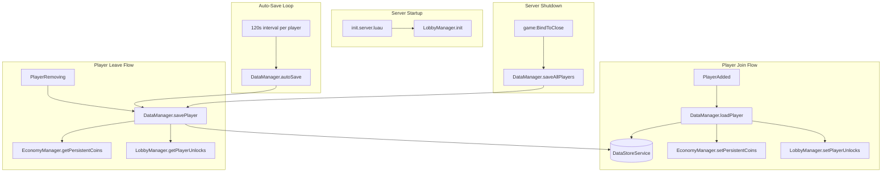

# Design Document: Persistent Data

## Overview

This feature introduces a centralized `DataManager` module (`src/server/DataManager.luau`) that persists player data (coins and turret unlocks) across server restarts using Roblox `DataStoreService`. Currently, `EconomyManager` stores persistent coins in an in-memory table (`playerPersistentCoins`) and `LobbyManager` stores turret unlocks in an in-memory table (`playerUnlocks`). Both reset on server restart.

DataManager becomes the single source of truth for save/load operations. It loads player data on join, saves on leave, auto-saves every 120 seconds, and saves all players on server shutdown via `game:BindToClose`. The existing modules continue to own the in-memory state; DataManager reads from them at save time and writes to them at load time.

## Architecture



### Key Design Decisions

1. **DataManager does not own in-memory state.** EconomyManager and LobbyManager continue to own `playerPersistentCoins` and `playerUnlocks` respectively. DataManager reads/writes through accessor functions on those modules. This avoids a large refactor and keeps the existing game loop untouched.

2. **Dirty flag per player.** DataManager tracks whether a player's data has changed since the last successful save. Save operations skip the DataStore call if the data is clean. EconomyManager and LobbyManager call `DataManager.markDirty(userId)` when they mutate persistent state.

3. **Staggered auto-save.** Each player's auto-save timer starts from their join time, naturally staggering saves across players. This avoids bursts of DataStore requests.

4. **Retry with backoff on save failure.** Save operations retry up to 3 times with a 1-second delay between attempts. This handles transient DataStore errors without blocking the game loop.

5. **Schema versioning.** The saved data includes a `version` field. On load, DataManager checks the version and migrates if needed. This allows future schema changes without breaking existing saves.

## Components and Interfaces

### DataManager (new module: `src/server/DataManager.luau`)

```luau
local DataManager = {}

-- Initialize DataManager. Called once from LobbyManager.init() before PlayerAdded fires.
function DataManager.init(): ()

-- Load player data from DataStore and initialize EconomyManager + LobbyManager state.
-- Called from PlayerAdded handler.
function DataManager.loadPlayer(player: Player): ()

-- Save player data to DataStore. Reads current state from EconomyManager + LobbyManager.
-- Called from PlayerRemoving handler, auto-save loop, and shutdown.
function DataManager.savePlayer(userId: number): boolean

-- Save all connected players. Called from game:BindToClose.
function DataManager.saveAllPlayers(): ()

-- Mark a player's data as dirty (needs saving).
-- Called by EconomyManager and LobbyManager when persistent state changes.
function DataManager.markDirty(userId: number): ()

-- Get the current PlayerData for a userId (reads from in-memory modules).
function DataManager.getPlayerData(userId: number): PlayerData

-- Clean up player tracking (called after save on leave).
function DataManager.removePlayer(userId: number): ()
```

### EconomyManager Changes

New functions to support DataManager:

```luau
-- Set persistent coins to a specific value (used by DataManager on load).
function EconomyManager.setPersistentCoins(userId: number, amount: number): ()
```

The existing `initPersistentCoins` sets coins to 0. The new `setPersistentCoins` sets coins to an arbitrary loaded value. Existing mutators (`addPersistentCoins`, `spendPersistentCoins`, `bankKillEarnings`) will call `DataManager.markDirty(userId)` after modifying state.

### LobbyManager Changes

New functions to support DataManager:

```luau
-- Set turret unlocks for a player (used by DataManager on load).
function LobbyManager.setPlayerUnlocks(userId: number, unlocks: { [number]: boolean }): ()

-- Get turret unlocks for a player (used by DataManager on save).
function LobbyManager.getPlayerUnlocks(userId: number): { [number]: boolean }
```

The existing `PlayerAdded` handler in `LobbyManager.init()` currently initializes unlocks to `{ [1] = true }` and calls `EconomyManager.initPersistentCoins(userId)`. This will be replaced with a call to `DataManager.loadPlayer(player)`, which handles both.

### init.server.luau Changes

No changes needed. `init.server.luau` already calls `LobbyManager.init()`, and DataManager will be initialized from within `LobbyManager.init()`.

## Data Models

### PlayerData Schema (version 1)

```luau
type PlayerData = {
    version: number,        -- Schema version, currently 1
    coins: number,          -- Persistent coin balance (non-negative)
    unlocks: { number },    -- Array of unlocked turret type ids
}
```

### DataStore Layout

- **DataStore name:** `"TowerDefenseData"`
- **Key format:** `"PlayerData_{UserId}"` (e.g., `"PlayerData_12345678"`)
- **Value:** JSON-encoded `PlayerData` table (handled automatically by DataStoreService)

### Example Stored Value

```json
{
    "version": 1,
    "coins": 350,
    "unlocks": [1, 3, 5]
}
```

### Validation Rules (applied on load)

| Field | Rule | Default |
|-------|------|---------|
| `version` | Must be a recognized number. Missing/unknown triggers migration. | Migrate to current version |
| `coins` | Must be a non-negative number. | `0` |
| `unlocks` | Each id must exist in `TurretData`. Unknown ids are removed. | `{ 1 }` |
| `unlocks` | Must always contain id `1` (Scout Turret). | Insert `1` if missing |

### In-Memory Tracking (inside DataManager)

```luau
-- Tracks dirty state and auto-save timing per player
type PlayerTracker = {
    dirty: boolean,
    lastSaveTime: number,  -- os.clock() of last successful save
}

local playerTrackers: { [number]: PlayerTracker } = {}
```


## Correctness Properties

*A property is a characteristic or behavior that should hold true across all valid executions of a system — essentially, a formal statement about what the system should do. Properties serve as the bridge between human-readable specifications and machine-verifiable correctness guarantees.*

### Property 1: Save-Load Round Trip

*For any* valid PlayerData record (non-negative coins, valid turret unlock ids including id 1), saving it to the DataStore and then loading it back should produce an equivalent PlayerData record with the same coin value and the same set of unlock ids.

**Validates: Requirements 5.6, 5.1, 2.2**

### Property 2: Load Initializes In-Memory State

*For any* valid PlayerData record returned by a Load_Operation, after `DataManager.loadPlayer` completes, `EconomyManager.getPersistentCoins(userId)` should return the saved coin value and `LobbyManager.getPlayerUnlocks(userId)` should return the saved unlock table.

**Validates: Requirements 1.2, 1.3**

### Property 3: Validation Cleans Invalid Data

*For any* raw data table where coins is negative, non-numeric, or nil, and/or unlocks contains turret ids not present in TurretData, the validation function should produce a PlayerData where coins is a non-negative number (defaulting to 0 for invalid values) and unlocks contains only ids that exist in TurretData.

**Validates: Requirements 5.3, 5.4**

### Property 4: Scout Turret Always Present

*For any* loaded PlayerData (including empty unlock tables, tables missing id 1, or nil data), after validation, the unlock table must contain turret id 1.

**Validates: Requirements 5.5**

### Property 5: Migration Produces Current Schema

*For any* raw data table with a missing, nil, or unrecognized version field, the migration function should produce a PlayerData record with the current schema version number and all required fields present.

**Validates: Requirements 5.2**

### Property 6: Key Format Consistency

*For any* numeric UserId, the DataStore key generated by DataManager should equal the string `"PlayerData_"` concatenated with the string representation of that UserId.

**Validates: Requirements 6.1**

### Property 7: Dirty Flag Controls Save Writes

*For any* player whose data has not been modified since the last successful save, a save operation should not write to DataStoreService. *For any* player whose data has been modified (marked dirty), a save operation should write to DataStoreService.

**Validates: Requirements 7.4, 7.2, 7.3**

## Error Handling

| Scenario | Behavior |
|----------|----------|
| `GetAsync` fails on player join | Log warning, initialize with defaults (0 coins, Scout Turret only). Player can still play; data will save on leave. |
| `SetAsync` fails on player leave | Retry up to 3 times with 1-second delay between attempts. If all retries fail, log error with UserId. |
| `SetAsync` fails during auto-save | Log warning. Data remains dirty and will be retried at the next 120-second interval. |
| `SetAsync` fails during shutdown | Log error with UserId. No retry — BindToClose has a 30-second hard limit and we must attempt all players. |
| Loaded coins is negative or non-numeric | Default to 0. |
| Loaded unlocks contain unknown turret ids | Remove unknown ids. Ensure id 1 is present. |
| Loaded data has no version field | Treat as version 0 and migrate to current schema. |

### Retry Implementation

```luau
local MAX_RETRIES = 3
local RETRY_DELAY = 1 -- seconds

local function saveWithRetry(key: string, data: PlayerData): boolean
    for attempt = 1, MAX_RETRIES do
        local ok, err = pcall(function()
            dataStore:SetAsync(key, data)
        end)
        if ok then
            return true
        end
        warn("[DataManager] Save failed for", key, "attempt", attempt, ":", err)
        if attempt < MAX_RETRIES then
            task.wait(RETRY_DELAY)
        end
    end
    return false
end
```

## Testing Strategy

### Dual Testing Approach

Both unit tests and property-based tests are required for comprehensive coverage.

**Unit tests** cover:
- Integration with mock DataStoreService (load on join, save on leave, shutdown save-all)
- Retry behavior on save failure (verify 3 retries with delays)
- Error logging on total failure
- Default initialization for new players (nil data from DataStore)
- Auto-save timer fires at expected intervals

**Property-based tests** cover:
- All 7 correctness properties above, each as a single property-based test
- Minimum 100 iterations per property test

### Test Infrastructure

The project already has a property-based testing framework:
- `src/tests/PropertyGen.luau` — random generators and `check` runner
- `src/tests/RunPropertyTests.luau` — test entry point

New files:
- `src/tests/DataPropertyTests.luau` — property tests for DataManager
- `src/tests/DataTestHarness.luau` — mock DataStoreService and test helpers

### Property-Based Testing Configuration

- Library: existing `PropertyGen.luau` (custom lightweight PBT for Luau)
- Iterations: 100 per property
- Each test tagged with: `Feature: persistent-data, Property {N}: {title}`

### New Generators (added to PropertyGen or DataTestHarness)

```luau
-- Generate a random valid PlayerData
function PropertyGen.playerData(): PlayerData

-- Generate a random raw/potentially-invalid data table for validation testing
function PropertyGen.rawPlayerData(): table

-- Generate a random UserId
function PropertyGen.userId(): number

-- Generate a random coin amount (including edge cases: 0, large values)
function PropertyGen.coinAmount(): number

-- Generate a random set of turret unlock ids (mix of valid and invalid)
function PropertyGen.unlockSet(): { number }
```

### Mock DataStoreService

The test harness provides a mock DataStore that stores data in a Luau table, allowing tests to verify save/load behavior without hitting the real Roblox DataStoreService. The mock supports:
- `GetAsync(key)` — returns stored value or nil
- `SetAsync(key, value)` — stores value
- Configurable failure injection for error handling tests
