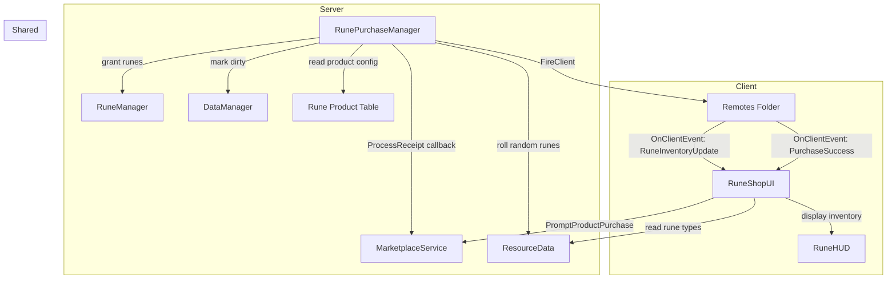

# Design Document: Rune Robux Purchase

## Overview

The Rune Robux Purchase feature enables players to purchase runes directly with Robux through Roblox's Developer Products system. This provides an alternative acquisition path alongside the existing boss-drop system. Players can buy individual runes (one of each type) or rune bundles (multiple random runes) through a dedicated Rune Shop UI.

The system introduces two new modules:
- **RunePurchaseManager.luau** (server) — handles Developer Product configuration, ProcessReceipt callback, and rune delivery
- **RuneShopUI.luau** (client) — displays available rune products and initiates purchases

The design follows the established patterns from GamepassManager for MarketplaceService integration and integrates with existing RuneManager, DataManager, and RuneHUD modules.

## Architecture



### Data Flow

1. **Product Configuration**: RunePurchaseManager defines a Rune_Product_Table mapping Developer Product IDs to reward configurations (rune type id and quantity, or "random" for bundles).

2. **Purchase Initiation**: Player clicks product in RuneShopUI → client calls `MarketplaceService:PromptProductPurchase(player, productId)` → Roblox displays native purchase prompt.

3. **Receipt Processing**: Player completes purchase → Roblox calls `ProcessReceipt` callback → RunePurchaseManager validates product ID → grants runes via RuneManager → marks data dirty → returns `PurchaseGranted` → fires `RuneInventoryUpdate` and `PurchaseSuccess` to client.

4. **UI Feedback**: Client receives `PurchaseSuccess` → RuneShopUI displays success notification → `RuneInventoryUpdate` updates displayed counts.

## Components and Interfaces

### RunePurchaseManager (Server Module)

```lua
-- Product configuration table
local RuneProductTable: { [number]: ProductConfig } = {
    -- Single rune products (product ID -> { runeTypeId, quantity })
    [EMBER_PRODUCT_ID] = { runeTypeId = 1, quantity = 1 },
    [FROST_PRODUCT_ID] = { runeTypeId = 2, quantity = 1 },
    -- ... products for all 10 rune types
    
    -- Bundle products (product ID -> { isBundle = true, quantity })
    [BUNDLE_5_PRODUCT_ID] = { isBundle = true, quantity = 5 },
}

-- Tracks processed purchase IDs to prevent duplicates
local processedPurchases: { [string]: boolean } = {}

-- Public API
RunePurchaseManager.init()
RunePurchaseManager.getProductTable(): { [number]: ProductConfig }
```

### RuneManager Extensions

```lua
-- New function to add runes (used by purchase system)
RuneManager.addRunes(userId: number, runeTypeId: number, quantity: number)
```

### RuneShopUI (Client Module)

```lua
RuneShopUI.init()
RuneShopUI.show()
RuneShopUI.hide()
RuneShopUI.setInventory(inventory: { [number]: number })
```

### New Remote Events

| Remote Name | Direction | Payload |
|---|---|---|
| `PurchaseSuccess` | Server → Client | `runesGranted: { [number]: number }` |

### Existing Remotes Used

| Remote Name | Direction | Payload |
|---|---|---|
| `RuneInventoryUpdate` | Server → Client | `inventory: { [number]: number }` |

### Integration Points

- **init.server.luau**: Call `RunePurchaseManager.init()` to register ProcessReceipt callback.
- **RuneManager**: Add `addRunes` function for granting purchased runes.
- **DataManager**: Called via `markDirty` after rune grants to ensure persistence.
- **init.client.luau**: Call `RuneShopUI.init()` to create shop UI.
- **RuneHUD**: Add shop button to access RuneShopUI during gameplay.
- **LobbyClient**: Add shop button to access RuneShopUI from lobby.

## Data Models

### Product Configuration

Defines the reward for each Developer Product.

```lua
type ProductConfig = {
    runeTypeId: number?,  -- specific rune type (1-10), nil for bundles
    quantity: number,     -- number of runes to grant
    isBundle: boolean?,   -- true for random rune bundles
}
```

### Rune Product Table

Maps Roblox Developer Product IDs to their reward configurations.

```lua
type RuneProductTable = { [number]: ProductConfig }
-- Example:
-- {
--     [123456789] = { runeTypeId = 1, quantity = 1 },  -- 1 Ember rune
--     [123456790] = { runeTypeId = 2, quantity = 1 },  -- 1 Frost rune
--     [123456800] = { isBundle = true, quantity = 5 }, -- 5 random runes
-- }
```

### Purchase Receipt

Roblox-provided data structure for ProcessReceipt callback.

```lua
type PurchaseReceipt = {
    PlayerId: number,
    ProductId: number,
    PurchaseId: string,
    CurrencySpent: number,
    CurrencyType: Enum.CurrencyType,
}
```

### Processed Purchases Cache

In-memory set of processed PurchaseIds to prevent duplicate grants within a session.

```lua
type ProcessedPurchases = { [string]: boolean }
```


## Correctness Properties

*A property is a characteristic or behavior that should hold true across all valid executions of a system — essentially, a formal statement about what the system should do. Properties serve as the bridge between human-readable specifications and machine-verifiable correctness guarantees.*

### Property 1: Product Table Validity

*For any* entry in the Rune_Product_Table, the configuration should be valid: either (a) a single-rune product with runeTypeId in [1, 10] and quantity > 0, or (b) a bundle product with isBundle = true and quantity > 0.

**Validates: Requirements 1.1**

### Property 2: Invalid Product Rejection

*For any* Developer Product ID not present in the Rune_Product_Table, processing a receipt with that ID should reject the purchase (return NotProcessedYet or log warning) and leave the player's rune inventory unchanged.

**Validates: Requirements 1.4, 2.2**

### Property 3: Correct Rune Delivery

*For any* valid product purchase by a player who is in the game, processing the receipt should increment the player's rune inventory by exactly the configured quantity for the specified rune type (or random types for bundles).

**Validates: Requirements 2.3, 3.1**

### Property 4: Successful Purchase Returns PurchaseGranted

*For any* valid product purchase that is successfully granted, the ProcessReceipt callback should return `Enum.ProductPurchaseDecision.PurchaseGranted`.

**Validates: Requirements 2.4**

### Property 5: Offline Player Returns NotProcessedYet

*For any* purchase receipt where the player is not currently in the game, the ProcessReceipt callback should return `Enum.ProductPurchaseDecision.NotProcessedYet` and not modify any rune inventories.

**Validates: Requirements 2.5**

### Property 6: Data Persistence on Grant

*For any* successful rune purchase grant, DataManager.markDirty should be called for the purchasing player to ensure the runes are persisted.

**Validates: Requirements 2.6**

### Property 7: Client Notification on Grant

*For any* successful rune purchase grant, a RuneInventoryUpdate remote event should be fired to the purchasing player's client with the updated inventory.

**Validates: Requirements 3.2**

### Property 8: Atomic Rune Granting

*For any* product that grants multiple runes, either all runes in the product are added to the player's inventory or none are. There should be no partial grants.

**Validates: Requirements 3.3**

### Property 9: Bundle Uses Random Drop Function

*For any* bundle product purchase, each rune granted should be determined by calling ResourceData.rollResourceDrop, producing rune type IDs in [1, 10] according to the existing drop weight distribution.

**Validates: Requirements 3.4**

### Property 10: Error Returns NotProcessedYet

*For any* purchase receipt that encounters an error during rune granting (e.g., RuneManager failure), the ProcessReceipt callback should return `Enum.ProductPurchaseDecision.NotProcessedYet` to allow Roblox to retry.

**Validates: Requirements 7.2**

### Property 11: Duplicate Purchase Prevention (Idempotency)

*For any* PurchaseId, processing the same receipt multiple times should grant runes exactly once. Subsequent processing of the same PurchaseId should return PurchaseGranted without modifying the player's inventory.

**Validates: Requirements 7.4**

### Property 12: Purchased Runes Equivalence

*For any* runes granted via purchase, they should be indistinguishable from runes earned via boss drops for all subsequent operations (application to turrets, return on game over, persistence).

**Validates: Requirements 8.3**

## Error Handling

| Scenario | Handler | Behavior |
|---|---|---|
| Unknown product ID in receipt | RunePurchaseManager.processReceipt | Log warning with ProductId, return NotProcessedYet |
| Player not in game | RunePurchaseManager.processReceipt | Return NotProcessedYet (Roblox will retry on next join) |
| RuneManager.addRunes fails | RunePurchaseManager.processReceipt | Log error with PurchaseId, return NotProcessedYet |
| Duplicate PurchaseId | RunePurchaseManager.processReceipt | Return PurchaseGranted without granting (already processed) |
| DataManager.markDirty fails | RunePurchaseManager.processReceipt | Log warning, still return PurchaseGranted (runes granted in memory) |
| Client disconnected during purchase | Roblox MarketplaceService | Receipt queued, processed on next join |
| Invalid rune type from rollResourceDrop | RunePurchaseManager.processReceipt | Should not occur (rollResourceDrop always returns 1-10), but clamp to valid range |

## Testing Strategy

### Property-Based Testing

All correctness properties (1–12) will be implemented as property-based tests using the existing `PropertyGen.luau` framework. Each test runs a minimum of 100 iterations with randomized inputs.

A new test harness `RunePurchaseTestHarness.luau` will be created mirroring the pattern of `RuneTestHarness.luau`. It will provide:
- Mock RunePurchaseManager with in-memory state
- Mock RuneManager for tracking rune grants
- Mock DataManager for tracking markDirty calls
- Mock Players service for simulating online/offline players

New generators in `PropertyGen.luau`:
- `PropertyGen.productId()` — random valid or invalid product ID
- `PropertyGen.purchaseId()` — random unique purchase ID string
- `PropertyGen.purchaseReceipt(playerId, productId)` — mock receipt structure

Test file: `src/tests/RunePurchasePropertyTests.luau`

Each test will be tagged with:
```
-- Feature: rune-robux-purchase, Property N: [property title]
```

### Unit Testing

Unit tests complement property tests for specific examples and edge cases:
- Verify product table contains all 10 single-rune products
- Verify product table contains at least one bundle product
- Verify specific product IDs map to correct rune types
- Verify bundle of 5 grants exactly 5 runes
- Verify duplicate PurchaseId is handled correctly
- Verify offline player receipt returns NotProcessedYet

### Integration Testing

Manual integration tests in Roblox Studio:
- Open Rune Shop from lobby → verify all products displayed
- Open Rune Shop during game → verify accessible from RuneHUD
- Purchase single rune → verify inventory updates immediately
- Purchase bundle → verify correct number of random runes granted
- Verify success notification appears and auto-dismisses
- Verify purchased runes can be applied to turrets
- Verify purchased runes persist after rejoin
