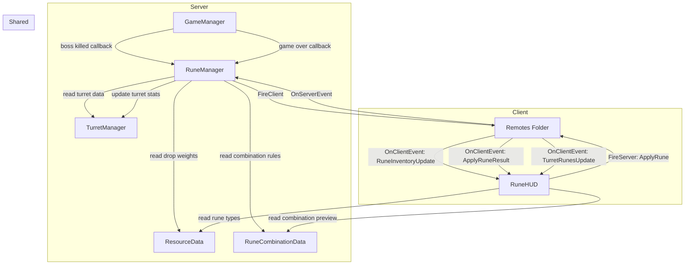

# Design Document: Rune System

## Overview

The Rune System adds elemental rune mechanics to the existing tower defense game. Players earn runes from boss kills, apply them to turrets during intermission, and benefit from synergy/clash effects when combining rune types. Runes persist on turrets until game over, then return to the player's inventory.

The system introduces three new modules:
- **RuneManager.luau** (server) — core logic for rune inventory, application, combination effects, and game-over return
- **RuneCombinationData.luau** (shared) — defines single-rune effects, synergy/clash pairs, and stat multipliers
- **RuneHUD.luau** (client) — rune inventory display and turret rune application UI

The design follows the existing client-server architecture using RemoteEvents in the Remotes folder, mirrors the pattern established by TurretManager/EconomyManager/TurretHUD, and reuses ResourceData for rune type definitions (colors, names, drop weights).

## Architecture



### Data Flow

1. **Boss Kill → Rune Drop**: EnemyManager fires `onKilled` → GameManager detects boss → calls `RuneManager.awardBossDrop(userIds, round)` → RuneManager uses `ResourceData.rollResourceDrop(round)` to pick a rune type → increments each player's rune inventory → fires `RuneInventoryUpdate` to clients.

2. **Rune Application**: Client clicks turret during intermission → RuneHUD fires `ApplyRune(turretInstanceId, runeTypeId)` → RuneManager validates (ownership, inventory count, intermission phase) → decrements inventory, adds rune to turret's rune slot → recomputes turret stats via combination table → updates TurretManager stats and model attributes → fires `RuneInventoryUpdate` + `TurretRunesUpdate` to clients.

3. **Game Over → Rune Return**: GameManager enters Game_Over_State → calls `RuneManager.returnAllRunes()` before session cleanup → RuneManager iterates all turrets, collects runes per owner, increments inventories, clears rune slots → fires `RuneInventoryUpdate` to clients.

## Components and Interfaces

### RuneManager (Server Module)

```lua
-- State
local playerRuneInventories: { [number]: { [number]: number } } = {}
-- { [turretInstanceId]: { runeTypeId, runeTypeId, ... } }
local turretRuneSlots: { [string]: { number } } = {}
local gamePhase: string = "LOBBY" -- tracked via GameManager callbacks

-- Public API
RuneManager.initPlayer(userId: number)
RuneManager.removePlayer(userId: number)
RuneManager.getInventory(userId: number): { [number]: number }
RuneManager.awardBossDrop(userIds: { number }, round: number): number
RuneManager.applyRune(userId: number, turretInstanceId: string, runeTypeId: number): (boolean, string?)
RuneManager.getTurretRunes(turretInstanceId: string): { number }
RuneManager.returnAllRunes()
RuneManager.clearAll()
RuneManager.setGamePhase(phase: string)
RuneManager.recomputeTurretStats(turretInstanceId: string)
```

### RuneCombinationData (Shared Module)

```lua
-- Single-rune effects: { [runeTypeId]: { damage: number?, range: number?, fireRate: number?, special: string? } }
RuneCombinationData.SingleEffects

-- Pairwise combinations: { [pairKey]: { type: "synergy"|"clash"|"neutral", damage: number?, range: number?, fireRate: number? } }
-- pairKey = min(a,b) .. "_" .. max(a,b) for canonical ordering
RuneCombinationData.PairEffects

-- Utility functions
RuneCombinationData.getSingleEffect(runeTypeId: number): RuneEffect
RuneCombinationData.getPairEffect(runeTypeA: number, runeTypeB: number): PairEffect
RuneCombinationData.computeCombinedMultipliers(runeSlot: { number }): { damage: number, range: number, fireRate: number, specials: { string } }
```

### RuneHUD (Client Module)

```lua
RuneHUD.init()
RuneHUD.show()
RuneHUD.hide()
RuneHUD.setInventory(inventory: { [number]: number })
RuneHUD.showRunePanel(turretInstanceId: string, currentRunes: { number })
RuneHUD.hideRunePanel()
```

### New Remote Events

| Remote Name | Direction | Payload |
|---|---|---|
| `ApplyRune` | Client → Server | `turretInstanceId: string, runeTypeId: number` |
| `ApplyRuneResult` | Server → Client | `success: boolean, reason: string?` |
| `RuneInventoryUpdate` | Server → Client | `inventory: { [number]: number }` |
| `TurretRunesUpdate` | Server → Client (broadcast) | `turretInstanceId: string, runes: { number }, stats: { damage, range, fireRate }` |

### Integration Points

- **GameManager.init()**: Register `RuneManager` callbacks — set game phase on state transitions, call `RuneManager.awardBossDrop` on boss kill, call `RuneManager.returnAllRunes()` in `setGameOver` before cleanup.
- **GameManager.createInstance()**: Add `ApplyRune` remote event listener that delegates to `RuneManager.applyRune`.
- **TurretManager**: No changes to TurretManager's core logic. RuneManager reads turret data via `TurretManager.getTurrets()` and writes back modified stats directly to turret instances.
- **EnemyManager**: No changes. Boss kill detection already exists in GameManager's `onEnemyKilled` callback.
- **init.client.luau**: Add `RuneHUD.init()` call.


## Data Models

### Rune Inventory

Per-player table mapping rune type id (1–10) to count. Stored in RuneManager server-side, mirrored to client via `RuneInventoryUpdate`.

```lua
type RuneInventory = { [number]: number }
-- Example: { [1] = 2, [2] = 0, [3] = 1, ... [10] = 0 }
```

### Turret Rune Slot

Per-turret-instance list of applied rune type ids. Stored in RuneManager, keyed by turret instance id.

```lua
type RuneSlot = { number }
-- Example: { 1, 3, 1 } -- two Ember runes and one Spark rune
```

### Single Rune Effect

Defines the stat multipliers and special effect for a single rune type applied alone.

```lua
type SingleRuneEffect = {
    damage: number?,    -- multiplier, e.g. 1.15
    range: number?,     -- multiplier, e.g. 1.25
    fireRate: number?,  -- multiplier, e.g. 1.2
    special: string?,   -- e.g. "slow", "poison", "critChance"
    specialParams: { [string]: number }?, -- e.g. { factor = 0.7, duration = 2 }
}
```

### Pair Effect

Defines the synergy/clash result for a specific pair of rune types.

```lua
type PairEffect = {
    type: "synergy" | "clash" | "neutral",
    damage: number?,   -- multiplier applied on top of single effects
    range: number?,
    fireRate: number?,
}
```

### Combined Multipliers Computation

When a turret has runes `[r1, r2, r3, ...]`:

1. Start with base multipliers `{ damage = 1, range = 1, fireRate = 1 }`.
2. For each unique rune type present, apply its single-rune stat multipliers (multiplicatively).
3. For each unique pair `(ri, rj)` where `i < j`, look up the pair effect and apply its multipliers.
4. Final turret stats = `baseStat × upgradeMultiplier^(level-1) × combinedRuneMultiplier`.

This means duplicate runes of the same type stack their single-rune effect (each copy multiplies again), but pair effects are only applied once per unique pair.

### Rune Combination Table Design

Thematic pairings based on elemental affinity:

**Synergies** (complementary elements):
- Ember + Spark → 1.2x damage (fire + lightning = plasma)
- Frost + Gale → 1.15x range, 1.1x fireRate (ice wind)
- Spore + Radiance → 1.2x range (nature + light = growth)
- Shadow + Void → 1.25x damage (dark amplification)
- Stone + Arcane → 1.15x damage, 1.1x range (enchanted earth)

**Clashes** (opposing elements):
- Ember + Frost → 0.85x damage (cancel out)
- Shadow + Radiance → 0.85x damage (light vs dark)
- Spore + Void → 0.9x fireRate (corruption vs nature)
- Spark + Stone → 0.9x fireRate (grounding)
- Gale + Stone → 0.9x range (wind blocked by earth)

All other pairs are neutral (no additional multiplier).


## Correctness Properties

*A property is a characteristic or behavior that should hold true across all valid executions of a system — essentially, a formal statement about what the system should do. Properties serve as the bridge between human-readable specifications and machine-verifiable correctness guarantees.*

### Property 1: Boss Drop Awards Exactly One Rune Per Player

*For any* round number and any set of player ids, calling `awardBossDrop` should increment exactly one rune type count by exactly one for each player, and the awarded rune type id should be in [1, 10].

**Validates: Requirements 1.1, 1.2**

### Property 2: Inventory Non-Negative Invariant

*For any* sequence of rune operations (init, award, apply, return), all rune inventory counts for all players should remain non-negative integers, and a freshly initialized player should have zero counts for all 10 rune types.

**Validates: Requirements 2.1, 2.2**

### Property 3: Ownership Validation Rejects Non-Owners

*For any* player and any turret instance not owned by that player, calling `applyRune` should return `(false, "Not your turret")` and leave both the player's inventory and the turret's rune slot unchanged.

**Validates: Requirements 3.2, 3.5**

### Property 4: Empty Inventory Validation

*For any* player with zero count of a given rune type, calling `applyRune` with that rune type should return `(false, "No runes of this type available")` and leave the turret's rune slot unchanged.

**Validates: Requirements 3.3, 3.6**

### Property 5: Phase Validation Rejects Non-Intermission Applications

*For any* game phase that is not "Intermission", calling `applyRune` should return `(false, "Runes can only be applied during intermission")` and leave both inventory and rune slot unchanged.

**Validates: Requirements 3.7, 3.8**

### Property 6: Valid Application Transfers Rune From Inventory to Slot

*For any* valid application (correct owner, non-zero inventory, intermission phase), calling `applyRune` should decrement the player's rune inventory count for that type by exactly one and append that rune type to the turret's rune slot, increasing its length by one.

**Validates: Requirements 3.4**

### Property 7: Combination Table Completeness

*For any* pair of distinct rune type ids (a, b) where a, b ∈ [1, 10] and a ≠ b, `getPairEffect(a, b)` should return a valid effect with type "synergy", "clash", or "neutral", and the result should be the same regardless of argument order (i.e., `getPairEffect(a, b)` equals `getPairEffect(b, a)`).

**Validates: Requirements 4.1**

### Property 8: Combined Multiplier Computation

*For any* rune slot (list of rune type ids), `computeCombinedMultipliers` should return multipliers equal to the product of all single-rune effects for each unique rune type (stacked per occurrence) multiplied by all unique pairwise effects. For a single-rune slot, the result should equal just that rune's single effect with no pair modifiers.

**Validates: Requirements 4.2, 4.5, 4.6**

### Property 9: Synergy and Clash Multiplier Direction

*For any* pair of rune types marked as "synergy" in the combination table, at least one of the stat multipliers (damage, range, fireRate) should be greater than 1.0. *For any* pair marked as "clash", at least one multiplier should be less than 1.0.

**Validates: Requirements 4.3, 4.4**

### Property 10: Single-Rune Effects Match Definitions

*For any* rune type id in [1, 10], the single-rune effect returned by `getSingleEffect` should match the defined multipliers from the requirements (e.g., Ember = 1.15x damage, Frost = slow effect, etc.), and all undefined stat multipliers should default to 1.0.

**Validates: Requirements 5.1, 5.2, 5.3, 5.4, 5.5, 5.6, 5.7, 5.8, 5.9, 5.10**

### Property 11: Rune Slots Persist Across Phase Transitions

*For any* turret with applied runes, changing the game phase (from intermission to wave, wave to intermission) should not alter the turret's rune slot contents.

**Validates: Requirements 6.1, 6.3**

### Property 12: Rune Return Round Trip

*For any* set of turrets with applied runes, calling `returnAllRunes` should: (a) increment each owning player's rune inventory by exactly the count of each rune type that was in their turrets' rune slots, and (b) clear all turret rune slots to empty. The total number of runes across all inventories after return should equal the total before application.

**Validates: Requirements 7.1, 7.2, 7.3**

## Error Handling

| Scenario | Handler | Behavior |
|---|---|---|
| Apply rune to non-owned turret | RuneManager.applyRune | Return `(false, "Not your turret")`, no state change |
| Apply rune with zero inventory | RuneManager.applyRune | Return `(false, "No runes of this type available")`, no state change |
| Apply rune outside intermission | RuneManager.applyRune | Return `(false, "Runes can only be applied during intermission")`, no state change |
| Apply rune to invalid turret id | RuneManager.applyRune | Return `(false, "Turret not found")`, no state change |
| Apply rune with invalid rune type id | RuneManager.applyRune | Return `(false, "Invalid rune type")`, no state change |
| Client sends malformed ApplyRune args | GameManager remote handler | Silently ignore (type check before calling RuneManager) |
| returnAllRunes called with no turrets | RuneManager.returnAllRunes | No-op, inventories unchanged |
| Player disconnects mid-game | RuneManager.removePlayer | Clean up player's inventory; runes on their turrets remain until game over return (returned to void since player left) |

## Testing Strategy

### Property-Based Testing

All correctness properties (1–12) will be implemented as property-based tests using the existing `PropertyGen.luau` framework. Each test runs a minimum of 100 iterations with randomized inputs.

A new test harness `RuneTestHarness.luau` will be created mirroring the pattern of `TurretTestHarness.luau`. It will provide:
- Mock RuneManager with in-memory state (no Roblox Instance dependencies)
- Mock turret data (reusing TurretTestHarness mock patterns)
- RuneCombinationData loaded directly (it's a pure data module with no Roblox deps)

New generators in `PropertyGen.luau`:
- `PropertyGen.runeTypeId()` — random id in [1, 10]
- `PropertyGen.runeSlot(maxSize)` — random list of rune type ids
- `PropertyGen.runeInventory()` — random inventory with counts in [0, 5]

Test file: `src/tests/RunePropertyTests.luau`

Each test will be tagged with:
```
-- Feature: rune-system, Property N: [property title]
```

### Unit Testing

Unit tests complement property tests for specific examples and edge cases:
- Verify each of the 10 single-rune effects produces correct multipliers (concrete values)
- Verify specific synergy pairs (e.g., Ember+Spark) produce expected multipliers
- Verify specific clash pairs (e.g., Ember+Frost) produce expected multipliers
- Verify rune application during wave phase is rejected
- Verify rune return with empty turrets is a no-op
- Verify duplicate runes on same turret stack correctly

### Integration Testing

Manual integration tests in Roblox Studio:
- Place turret → apply rune during intermission → verify visual glow appears
- Apply multiple runes → verify stat changes in BillboardGui
- Kill boss → verify rune inventory updates in RuneHUD
- Game over → verify runes return to inventory
- Verify RuneHUD panel opens/closes correctly on turret click

