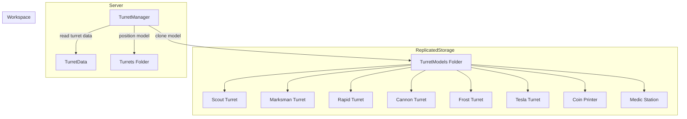

# Design Document: Turret 3D Models

## Overview

This feature replaces the procedurally-generated turret models in TurretManager with artist-created 3D models stored in ReplicatedStorage. Each of the 8 turret types gets a unique visual design that reflects its role and tier, creating a clear visual progression from the free Scout Turret to the endgame Tesla Turret.

The implementation requires:
- **Model Storage**: 8 turret models stored in `ReplicatedStorage.TurretModels`
- **Model Loader**: Updates to `TurretManager.luau` to clone and position models instead of building them procedurally
- **Consistent Structure**: All models follow a standard hierarchy (Base, Barrel/Body, MuzzlePoint/EffectPoint) for compatibility with existing placement, aiming, and effect systems

The actual 3D models will be created manually in Roblox Studio. This design focuses on the code integration and model structure requirements.

## Architecture



### Data Flow

1. **Turret Placement**: Player requests turret placement → TurretManager validates → looks up turret name from TurretData → clones model from `ReplicatedStorage.TurretModels[turretName]` → sets PrimaryPart CFrame to placement position → parents to `Workspace.Turrets` → applies owner color and attributes.

2. **Model Fallback**: If model not found in TurretModels → TurretManager logs warning → uses existing procedural `buildTurretModel` function as fallback → ensures game remains playable during development.

3. **Aiming (Combat Turrets)**: Existing targeting code finds Barrel part → rotates Barrel to face target → projectile spawns from MuzzlePoint attachment position.

4. **Effects (Support Turrets)**: Coin Printer/Medic Station effects originate from EffectPoint attachment → existing animation code reads attachment position.

## Components and Interfaces

### Model Loader (TurretManager Updates)

```lua
-- New helper function to load model from ReplicatedStorage
local function loadTurretModel(turretName: string): Model?
    local turretModels = game.ReplicatedStorage:FindFirstChild("TurretModels")
    if not turretModels then
        warn("[TurretManager] TurretModels folder not found in ReplicatedStorage")
        return nil
    end
    
    local model = turretModels:FindFirstChild(turretName)
    if not model then
        warn("[TurretManager] Model not found for turret: " .. turretName)
        return nil
    end
    
    return model:Clone()
end

-- Updated buildTurretModel signature (internal change)
local function buildTurretModel(
    position: Vector3, 
    turretType: TurretType, 
    level: number, 
    ownerColor: Color3?, 
    ownerName: string?
): Model
    -- Try to load pre-made model first
    local model = loadTurretModel(turretType.name)
    
    if model then
        -- Use pre-made model
        setupLoadedModel(model, position, turretType, level, ownerColor, ownerName)
    else
        -- Fallback to procedural generation (existing code)
        model = buildProceduralModel(position, turretType, level, ownerColor, ownerName)
    end
    
    return model
end

-- Setup function for loaded models
local function setupLoadedModel(
    model: Model,
    position: Vector3,
    turretType: TurretType,
    level: number,
    ownerColor: Color3?,
    ownerName: string?
)
    -- Position the model
    local base = model.PrimaryPart
    if base then
        model:SetPrimaryPartCFrame(CFrame.new(position))
    end
    
    -- Set standard attributes
    model:SetAttribute("TurretInstanceId", "")
    model:SetAttribute("TurretTypeId", turretType.id)
    model:SetAttribute("TurretLevel", level)
    model:SetAttribute("TurretDamage", turretType.damage)
    model:SetAttribute("TurretRange", turretType.range)
    model:SetAttribute("TurretFireRate", turretType.fireRate)
    
    -- Apply owner color to Body part if exists
    if ownerColor then
        applyOwnerColor(model, ownerColor, ownerName or "")
    end
    
    -- Add BillboardGui for level/upgrade display
    addTurretInfoGui(model, turretType, level)
    
    -- Add ProximityPrompt for upgrades
    addUpgradePrompt(model, turretType, level)
    
    -- Parent to workspace
    model.Parent = workspace
end
```

### Model Structure Requirements

Each turret model must follow this hierarchy:

**Combat Turrets (Scout, Marksman, Rapid, Cannon, Frost, Tesla):**
```
Model (Name = turret name from TurretData)
├── Base (Part) - PrimaryPart, Anchored=true, CanCollide=true
├── Body (Part) - colored by owner
├── Barrel (Part) - rotates to aim at enemies
│   └── MuzzlePoint (Attachment) - projectile spawn point
└── [Optional additional detail parts]
```

**Support Turrets (Coin Printer, Medic Station):**
```
Model (Name = turret name from TurretData)
├── Base (Part) - PrimaryPart, Anchored=true, CanCollide=true
├── Body (Part) - colored by owner
├── EffectPoint (Attachment) - effect origin point
└── [Optional additional detail parts]
```

### Turrets Folder Setup

On server init, ensure the Turrets folder exists:

```lua
-- In TurretManager.init() or GameManager.init()
local function ensureTurretsFolder()
    local folder = workspace:FindFirstChild("Turrets")
    if not folder then
        folder = Instance.new("Folder")
        folder.Name = "Turrets"
        folder.Parent = workspace
    end
    return folder
end
```

### Integration Points

- **TurretManager.placeTurret()**: Calls updated `buildTurretModel` which now tries to load pre-made models first
- **TurretManager.upgradeTurret()**: No changes needed - still updates attributes and GUI on existing model
- **Targeting/Aiming**: Existing code already looks for Barrel part - models must include it
- **fireProjectile()**: Needs update to read MuzzlePoint attachment position instead of hardcoded offset
- **Support Effects**: Existing code needs update to read EffectPoint attachment position

## Data Models

### Turret Model Naming Convention

Models must be named exactly as they appear in TurretData:

| TurretData.name | Model Name in ReplicatedStorage |
|-----------------|--------------------------------|
| "Scout Turret" | "Scout Turret" |
| "Marksman Turret" | "Marksman Turret" |
| "Rapid Turret" | "Rapid Turret" |
| "Cannon Turret" | "Cannon Turret" |
| "Frost Turret" | "Frost Turret" |
| "Tesla Turret" | "Tesla Turret" |
| "Coin Printer" | "Coin Printer" |
| "Medic Station" | "Medic Station" |

### Visual Tier Classification

| Tier | Turrets | Part Count | Visual Complexity |
|------|---------|------------|-------------------|
| Basic | Scout Turret | ≤10 | Simple shapes, muted colors |
| Standard | Marksman Turret | ≤15 | Added details, accent colors |
| Advanced | Rapid Turret | ≤20 | Multiple components, industrial look |
| Elite | Cannon, Frost | ≤25 | Heavy/magical details, effects |
| Legendary | Tesla Turret | ≤35 | Elaborate design, animated effects |
| Support | Coin Printer, Medic | ≤20 | Utility-focused, clear purpose |

### Required Part Properties

**Base Part:**
- Name: "Base"
- Anchored: true
- CanCollide: true
- Set as Model.PrimaryPart

**Body Part:**
- Name: "Body"
- Will receive owner color tinting
- Anchored: true
- CanCollide: false

**Barrel Part (Combat only):**
- Name: "Barrel"
- Contains MuzzlePoint Attachment
- Anchored: true (TurretManager handles rotation via CFrame)
- CanCollide: false

**MuzzlePoint Attachment (Combat only):**
- Name: "MuzzlePoint"
- Parent: Barrel
- Position: tip of barrel where projectiles spawn

**EffectPoint Attachment (Support only):**
- Name: "EffectPoint"
- Parent: Model (or Body)
- Position: where visual effects originate


## Correctness Properties

*A property is a characteristic or behavior that should hold true across all valid executions of a system — essentially, a formal statement about what the system should do. Properties serve as the bridge between human-readable specifications and machine-verifiable correctness guarantees.*

### Property 1: Model Naming Matches TurretData

*For any* turret type defined in TurretData, the expected model name in ReplicatedStorage.TurretModels should exactly match the `name` field from TurretData (e.g., "Scout Turret", "Tesla Turret").

**Validates: Requirements 1.2**

### Property 2: Combat Turret Model Structure

*For any* combat turret model (Scout, Marksman, Rapid, Cannon, Frost, Tesla), the model should contain: (a) a Part named "Base" set as PrimaryPart, (b) a Part named "Body", (c) a Part named "Barrel", and (d) an Attachment named "MuzzlePoint" parented to the Barrel.

**Validates: Requirements 2.1, 2.2, 2.3**

### Property 3: Support Turret Model Structure

*For any* support turret model (Coin Printer, Medic Station), the model should contain: (a) a Part named "Base" set as PrimaryPart, (b) a Part named "Body", and (c) an Attachment named "EffectPoint".

**Validates: Requirements 2.1, 2.4**

### Property 4: Base Part Properties After Placement

*For any* turret model after placement, the Base part should have Anchored set to true and CanCollide set to true.

**Validates: Requirements 2.5**

### Property 5: Model Lookup By Name

*For any* turret type id, calling the model loader with that turret's name should return a model from ReplicatedStorage.TurretModels with a matching name, or nil if not found.

**Validates: Requirements 1.1, 11.1**

### Property 6: Placement Positions Model Correctly

*For any* placement position Vector3, after placing a turret at that position, the model's PrimaryPart (Base) CFrame position should equal the placement position.

**Validates: Requirements 11.3**

### Property 7: Model Parented To Turrets Folder

*For any* placed turret, the model should be parented to a folder named "Turrets" in Workspace.

**Validates: Requirements 11.4**

### Property 8: Part Count Respects Tier Limits

*For any* turret model, the total part count should not exceed the tier limit: Scout ≤10, Marksman ≤15, Rapid ≤20, Cannon ≤25, Frost ≤25, Tesla ≤35, Coin Printer ≤20, Medic Station ≤15.

**Validates: Requirements 3.3, 4.4, 5.4, 6.5, 7.5, 8.5, 9.5, 10.5**

### Property 9: Visual Complexity Increases With Price

*For any* two combat turret types where turret A has a higher shop price than turret B, turret A's model should have a part count greater than or equal to turret B's model part count.

**Validates: Requirements 12.1, 12.4**

## Error Handling

| Scenario | Handler | Behavior |
|----------|---------|----------|
| TurretModels folder not found | loadTurretModel | Log warning, return nil (triggers fallback) |
| Specific turret model not found | loadTurretModel | Log warning with turret name, return nil (triggers fallback) |
| Model missing Base part | setupLoadedModel | Log error, skip positioning (model may appear at origin) |
| Model missing Barrel (combat) | Targeting code | Skip aiming, projectile spawns from model center |
| Model missing MuzzlePoint | fireProjectile | Use Barrel position as fallback spawn point |
| Model missing EffectPoint (support) | Support effect code | Use model PrimaryPart position as fallback |
| Turrets folder not in Workspace | ensureTurretsFolder | Create the folder automatically |

## Testing Strategy

### Property-Based Testing

Properties 1, 2, 3, 5, 8, and 9 will be implemented as property-based tests. Since these tests validate model structure and don't require Roblox runtime, they can use mock model data.

A test harness `TurretModelTestHarness.luau` will provide:
- Mock model structures representing each turret type
- Part count validation functions
- Structure validation functions

Test file: `src/tests/TurretModelPropertyTests.luau`

Each test will be tagged with:
```
-- Feature: turret-3d-models, Property N: [property title]
```

**Minimum 100 iterations** per property test where randomization applies.

### Unit Testing

Unit tests for specific examples and edge cases:
- Verify Scout Turret has exactly the required parts (Base, Body, Barrel, MuzzlePoint)
- Verify Tesla Turret has ParticleEmitter and PointLight
- Verify Frost Turret has ParticleEmitter
- Verify Coin Printer has SurfaceGui
- Verify fallback to procedural model when model not found
- Verify model attributes are set correctly after placement

### Manual Testing in Roblox Studio

Since the actual 3D models are created manually, visual validation requires Studio testing:
- Verify each model loads correctly when turret is placed
- Verify barrel rotation works for combat turrets
- Verify projectiles spawn from MuzzlePoint position
- Verify owner color applies to Body part
- Verify visual progression is clear (Scout looks simple, Tesla looks elaborate)
- Verify support turret effects originate from EffectPoint

### Model Validation Checklist

Before committing each model, verify:
- [ ] Model name matches TurretData exactly
- [ ] Base part exists and is set as PrimaryPart
- [ ] Body part exists
- [ ] Barrel part exists (combat only)
- [ ] MuzzlePoint attachment on Barrel (combat only)
- [ ] EffectPoint attachment exists (support only)
- [ ] Part count within tier limit
- [ ] All parts Anchored = true
- [ ] Base CanCollide = true, other parts CanCollide = false
