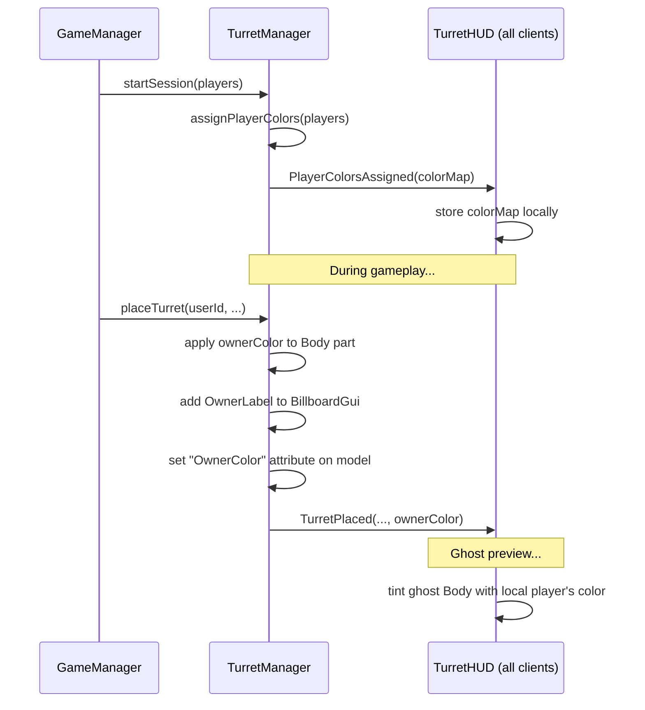

# Design Document: Turret Player Colors

## Overview

This feature adds per-player color coding to turrets in the 2-player tower defense game. When a game session starts, each player is assigned a distinct color from a fixed 2-color palette. That color is applied to the Body part of every turret they place (combat and support), displayed in an owner name label on the turret's BillboardGui, and tinted onto the ghost preview during placement mode. The server broadcasts color assignments to all clients via a remote event so both players see consistent ownership visuals.

The implementation touches three main modules:
- `TurretManager` (server) — assigns colors at session start, applies color on placement/upgrade, broadcasts assignments
- `TurretHUD` (client) — stores the player-to-color mapping, tints ghost preview, reads owner color from model attributes
- `PropertyGen` / test harness — extended with generators for player color testing

## Architecture



The color assignment is a pure function of join order: Player 1 gets color index 1, Player 2 gets color index 2. This is deterministic and requires no negotiation.

## Components and Interfaces

### Color Palette (shared constant)

A new shared module or inline constant defining the two player colors:

```luau
local PLAYER_COLORS: { Color3 } = {
    Color3.fromRGB(50, 130, 255),  -- Blue (Player 1)
    Color3.fromRGB(255, 80, 80),   -- Red (Player 2)
}
```

These are chosen for high contrast against the grey/metal turret base and the green/brown game environment.

### TurretManager additions (server)

| Function / Field | Description |
|---|---|
| `playerColors: { [number]: Color3 }` | Maps userId → assigned Color3. Populated at session start. |
| `TurretManager.assignPlayerColors(players: { Player })` | Assigns colors from PLAYER_COLORS by join order. |
| `TurretManager.getPlayerColor(userId: number): Color3?` | Returns the assigned color for a player. |
| `applyOwnerColor(model, ownerColor, ownerName)` | Internal helper: sets Body.Color, adds OwnerLabel, sets "OwnerColor" attribute. |

Changes to existing functions:
- `buildTurretModel` — calls `applyOwnerColor` after building the model
- `upgradeTurret` — preserves OwnerLabel and OwnerColor through the billboard rebuild
- `placeTurret` — passes owner color to `buildTurretModel`

### TurretHUD additions (client)

| Function / Field | Description |
|---|---|
| `playerColorMap: { [number]: Color3 }` | Local cache of userId → Color3, received from server. |
| `localPlayerColor: Color3?` | Convenience reference to the local player's color. |
| `buildGhost` modification | Tints the ghost Body part with `localPlayerColor`. |

### Remote Events

| Remote | Direction | Payload |
|---|---|---|
| `PlayerColorsAssigned` | Server → All Clients | `{ [number]: { R: number, G: number, B: number } }` (userId → color components) |
| `TurretPlaced` (existing) | Server → All Clients | Extended with `ownerColor: Color3` as additional argument |

### Model Attributes

| Attribute | Type | Set By | Read By |
|---|---|---|---|
| `OwnerColor` | Color3 | TurretManager (server) | TurretHUD (client) |
| `OwnerId` | number | TurretManager (already exists via ownerId) | TurretHUD (client) |

## Data Models

### Player Color Assignment State

```luau
-- Stored in TurretManager module state
local playerColors: { [number]: Color3 } = {}
```

This is a session-scoped mapping. It is populated once when `assignPlayerColors` is called and cleared when the game instance stops (`TurretManager.clearAll`).

### Color Palette Definition

```luau
-- Could live in TurretManager or a shared PlayerColors module
local PLAYER_COLORS: { Color3 } = {
    Color3.fromRGB(50, 130, 255),   -- Player 1: Blue
    Color3.fromRGB(255, 80, 80),    -- Player 2: Red
}
```

### Extended TurretInstance (conceptual — no schema change needed)

The existing `TurretInstance` type already has `ownerId`. The owner color is derived from `playerColors[ownerId]` at runtime rather than stored redundantly on the instance. The model attribute `OwnerColor` is set for client-side reading.

### BillboardGui OwnerLabel

```luau
-- Added as a child of the existing TurretInfo BillboardGui
{
    Name = "OwnerLabel",
    ClassName = "TextLabel",
    Size = UDim2.new(1, 0, 0.35, 0),
    Position = UDim2.new(0, 0, 1, 0),  -- below existing labels
    Text = playerDisplayName,
    TextColor3 = ownerColor,
}
```


## Correctness Properties

*A property is a characteristic or behavior that should hold true across all valid executions of a system — essentially, a formal statement about what the system should do. Properties serve as the bridge between human-readable specifications and machine-verifiable correctness guarantees.*

### Property 1: Distinct Color Assignment by Join Order

*For any* pair of 2 players with distinct userIds, calling `assignPlayerColors` should assign the first player (by join order) the first palette color and the second player the second palette color, and the two assigned colors must not be equal.

**Validates: Requirements 1.1, 1.3**

### Property 2: Placement Applies Owner Color to Body and Model Attribute

*For any* player with an assigned color and any valid turret placement (combat or support), the resulting turret model's Body part color should equal the player's assigned color, and the model's "OwnerColor" attribute should equal the same color.

**Validates: Requirements 2.1, 2.2, 2.4, 5.2**

### Property 3: Placement Adds OwnerLabel with Correct Name and Color

*For any* turret placement by a player with display name N and assigned color C, the turret's BillboardGui should contain an OwnerLabel whose Text equals N and whose TextColor3 equals C.

**Validates: Requirements 3.1, 3.2**

### Property 4: Upgrade Preserves Owner Visuals

*For any* placed turret that is upgraded, the Body part color, the "OwnerColor" model attribute, and the OwnerLabel (text and text color) should remain unchanged after the upgrade.

**Validates: Requirements 2.3, 3.3**

### Property 5: Ghost Preview Tinted with Player Color

*For any* player color C, building a ghost preview model should produce a model whose Body part color equals C.

**Validates: Requirements 4.1**

### Property 6: Client Color Map Storage Round Trip

*For any* mapping of userIds to colors received from the server, storing it in the client's `playerColorMap` and then querying any userId should return the originally assigned color.

**Validates: Requirements 5.3**

## Error Handling

| Scenario | Handling |
|---|---|
| `assignPlayerColors` called with 0 players | No-op; `playerColors` remains empty. `getPlayerColor` returns nil. |
| `assignPlayerColors` called with >2 players | Only the first 2 players receive colors (palette has 2 entries). Additional players get nil from `getPlayerColor`. |
| `getPlayerColor` called for unknown userId | Returns nil. Turret placement still succeeds but Body keeps its default color. |
| `PlayerColorsAssigned` remote not received by client | `localPlayerColor` stays nil; ghost preview uses default color (no tint). Turrets placed by others show default color until next broadcast. |
| Model missing Body part (unexpected) | `applyOwnerColor` silently skips coloring if Body is not found. OwnerLabel and attribute are still set. |

## Testing Strategy

### Unit Tests

- Verify `PLAYER_COLORS` palette has exactly 2 entries and they are distinct (example test).
- Verify single-player session assigns color index 1 (edge case from requirement 1.4).
- Verify `PlayerColorsAssigned` remote event is created in the Remotes folder.
- Verify `applyOwnerColor` handles a model with no Body part gracefully.

### Property-Based Tests

All property tests use the existing `PropertyGen.check` runner with a minimum of 100 iterations each. The test harness (`TurretTestHarness`) will be extended with color assignment logic mirroring the real `TurretManager`.

| Property | Test Tag | Iterations |
|---|---|---|
| 1: Distinct Color Assignment | `Feature: turret-player-colors, Property 1: Distinct Color Assignment by Join Order` | 100 |
| 2: Placement Applies Owner Color | `Feature: turret-player-colors, Property 2: Placement Applies Owner Color to Body and Model Attribute` | 100 |
| 3: OwnerLabel Name and Color | `Feature: turret-player-colors, Property 3: Placement Adds OwnerLabel with Correct Name and Color` | 100 |
| 4: Upgrade Preserves Visuals | `Feature: turret-player-colors, Property 4: Upgrade Preserves Owner Visuals` | 100 |
| 5: Ghost Preview Tint | `Feature: turret-player-colors, Property 5: Ghost Preview Tinted with Player Color` | 100 |
| 6: Client Color Map Round Trip | `Feature: turret-player-colors, Property 6: Client Color Map Storage Round Trip` | 100 |

Property-based testing library: `PropertyGen.luau` (existing lightweight PBT helper in the project). Each test must reference its design property in a comment using the tag format above. Each correctness property is implemented by a single property-based test function.
