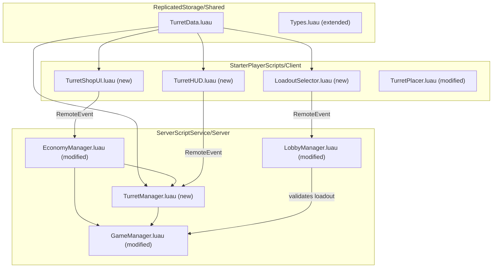
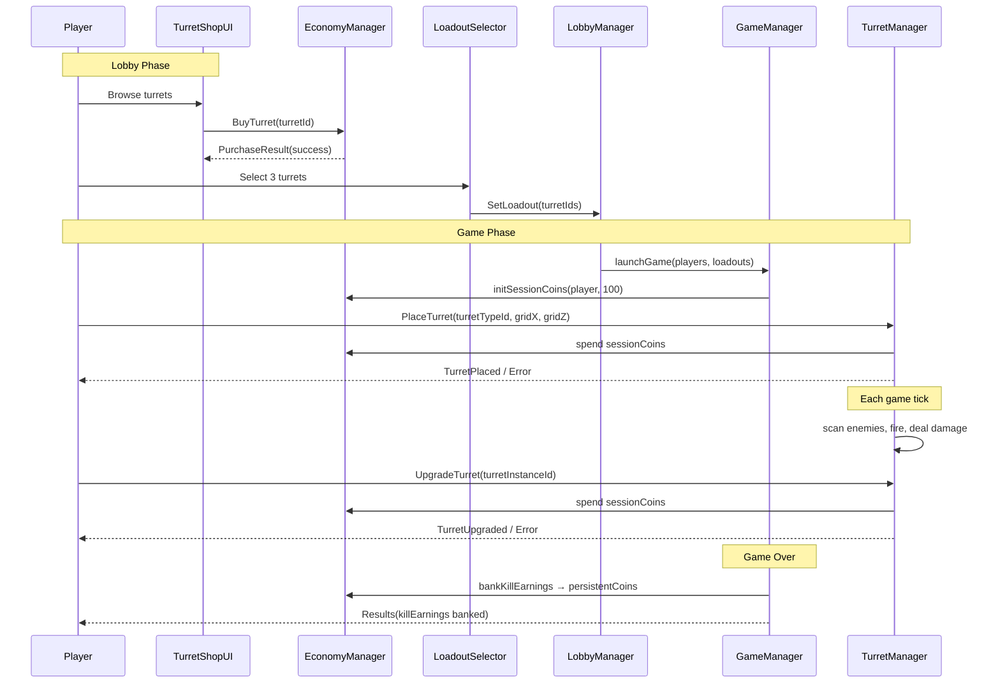

# Design Document: Turret System

## Overview

The turret system adds a pre-defined turret mechanic that runs alongside the existing resource-combo tower system. Unlike combo towers (which derive stats from resource combinations), turrets are fixed-stat blueprints purchased with persistent coins in a lobby shop and placed during gameplay using session coins.

The system introduces a dual-coin economy: **Session_Coins** are earned per-game from enemy kills and spent on in-game turret placement/upgrades, while **Persistent_Coins** are banked from kill earnings at game over and spent in the lobby shop. A loadout system lets players select 3 turrets before entering a game, and an in-game HUD provides turret placement and upgrade controls.

Key integration points:
- **EconomyManager** is extended with a second coin pool (persistent) and kill-earnings tracking
- **GameManager** lifecycle hooks handle session coin init, kill-earnings accumulation, and banking on game over
- **LobbyManager** enforces loadout validation before game launch
- New shared module **TurretData.luau** defines all turret type blueprints
- New server module **TurretManager.luau** handles turret placement, targeting, shooting, and upgrades
- New client modules handle lobby shop UI, loadout selector UI, and in-game turret HUD

## Architecture



### Module Responsibilities

| Module | Role |
|--------|------|
| `TurretData.luau` | Shared turret type definitions (stats, prices, upgrade multipliers) |
| `TurretManager.luau` | Server-side turret placement, targeting, shooting, upgrades, cleanup |
| `EconomyManager.luau` | Extended with `sessionCoins`, `persistentCoins`, `killEarnings` pools |
| `GameManager.luau` | Hooks for session coin init, kill-earnings tracking, banking on game over |
| `LobbyManager.luau` | Loadout validation before game launch |
| `TurretShopUI.luau` | Lobby shop UI for browsing/buying turrets with persistent coins |
| `LoadoutSelector.luau` | Lobby loadout picker UI (select 3 turrets) |
| `TurretHUD.luau` | In-game HUD showing loadout buttons, placement cost, upgrade panel |

### Data Flow



## Components and Interfaces

### TurretData.luau (Shared)

```luau
-- Type definition
export type TurretType = {
    id: number,
    name: string,
    description: string,
    damage: number,
    range: number,
    fireRate: number,          -- shots per second
    shopPrice: number,         -- persistent coins to unlock
    placementCost: number,     -- session coins to place
    upgradeMultipliers: {      -- per-level multipliers (applied at levels 2, 3)
        damage: number,
        range: number,
        fireRate: number,
    },
}

-- Functions
getTurretById(id: number) -> TurretType?
getAllTurrets() -> { TurretType }
```

### TurretManager.luau (Server)

```luau
-- Turret instance tracked during gameplay
type TurretInstance = {
    id: string,
    turretTypeId: number,
    ownerId: number,
    gridX: number,
    gridZ: number,
    position: Vector3,
    level: number,           -- 1 (base), 2, 3
    stats: { damage: number, range: number, fireRate: number },
    model: Model,
    cooldown: number,
}

-- Functions
placeTurret(userId: number, turretTypeId: number, gridX: number, gridZ: number, worldPos: Vector3) -> (boolean, string?)
upgradeTurret(turretInstanceId: string, userId: number) -> (boolean, string?)
update(dt: number)           -- called each heartbeat: targeting + shooting
getTurrets() -> { [string]: TurretInstance }
clearAll()
getUpgradeCost(turretTypeId: number, targetLevel: number) -> number
```

### EconomyManager.luau (Modified)

New functions added alongside existing `money` pool (which remains for combo towers):

```luau
-- Session coins (in-game, reset per session)
initSessionCoins(userId: number, startingAmount: number)
getSessionCoins(userId: number) -> number
addSessionCoins(userId: number, amount: number)
spendSessionCoins(userId: number, amount: number) -> boolean

-- Persistent coins (lobby, persists across sessions)
initPersistentCoins(userId: number)
getPersistentCoins(userId: number) -> number
addPersistentCoins(userId: number, amount: number)
spendPersistentCoins(userId: number, amount: number) -> boolean

-- Kill earnings tracking (per session)
initKillEarnings(userId: number)
addKillEarnings(userId: number, amount: number)
getKillEarnings(userId: number) -> number
bankKillEarnings(userId: number)  -- transfers killEarnings → persistentCoins
```

### GameManager.luau (Modified)

Changes to `createInstance`:
- On `init()`: call `EconomyManager.initSessionCoins(userId, 100)` and `EconomyManager.initKillEarnings(userId)` for each player
- On `onEnemyKilled`: call `EconomyManager.addSessionCoins(userId, reward)` and `EconomyManager.addKillEarnings(userId, reward)` for each player
- On game over: call `EconomyManager.bankKillEarnings(userId)` for each player, fire `TurretGameOver` remote with kill earnings data
- On `update(dt)`: call `TurretManager.update(dt)` alongside `TowerManager.update(dt)`
- On `stop()`: call `TurretManager.clearAll()`
- Wire new remotes: `PlaceTurret`, `UpgradeTurret`, `TurretPlaced`, `TurretUpgraded`, `TurretError`, `SessionCoinsUpdate`, `KillEarningsUpdate`

### LobbyManager.luau (Modified)

- Store player loadouts: `playerLoadouts: { [number]: { number } }` (userId → array of 3 turret type ids)
- Wire `SetLoadout` remote: validates all turret ids are unlocked, stores loadout
- Wire `BuyTurret` remote: validates persistent coins, unlocks turret, deducts coins
- On `launchGame`: pass loadouts to GameManager, reject launch if any player has fewer than 3 loadout slots filled
- Store player unlocked turrets: `playerUnlocks: { [number]: { [number]: boolean } }` (userId → set of turret ids)
- On player join: initialize unlocks with turret id 1 (Scout Turret) unlocked by default

### Client Modules

**TurretShopUI.luau**: Renders a scrolling list of all turret types. Each entry shows name, description, stats, shopPrice, placementCost. Locked turrets show a "Buy" button; unlocked turrets show a checkmark. Listens to `ShopUpdate` remote for state changes.

**LoadoutSelector.luau**: Shows unlocked turrets as selectable tiles. Player taps to toggle selection. Displays 3 loadout slots. If only 1 turret unlocked, auto-fills all 3 slots. Fires `SetLoadout` remote. Persists selection in module state (server session scope).

**TurretHUD.luau**: In-game overlay with 3 loadout turret buttons at the bottom. Clicking a button enters turret placement mode (reuses grid slot system from TowerPlacer). Shows session coin balance. Clicking a placed turret opens an upgrade panel with current level, stats, and upgrade cost.

### Remote Events (New)

| Remote | Direction | Payload |
|--------|-----------|---------|
| `BuyTurret` | Client → Server | `turretTypeId: number` |
| `BuyTurretResult` | Server → Client | `success: boolean, reason: string?` |
| `SetLoadout` | Client → Server | `turretIds: { number }` |
| `SetLoadoutResult` | Server → Client | `success: boolean, reason: string?` |
| `PlaceTurret` | Client → Server | `turretTypeId: number, gridX: number, gridZ: number, worldX: number, worldZ: number` |
| `PlaceTurretResult` | Server → Client | `success: boolean, reason: string?` |
| `TurretPlaced` | Server → All Clients | `turretTypeId, gridX, gridZ, worldX, worldZ, instanceId` |
| `UpgradeTurret` | Client → Server | `turretInstanceId: string` |
| `UpgradeTurretResult` | Server → Client | `success: boolean, reason: string?` |
| `TurretUpgraded` | Server → All Clients | `instanceId, newLevel, newStats` |
| `SessionCoinsUpdate` | Server → Client | `amount: number` |
| `KillEarningsUpdate` | Server → Client | `amount: number` |
| `ShopUpdate` | Server → Client | `unlocks: { [number]: boolean }, persistentCoins: number` |
| `TurretGameOver` | Server → Client | `killEarningsBanked: number, newPersistentBalance: number` |

## Data Models

### TurretType Definitions (TurretData.luau)

| id | name | damage | range | fireRate | shopPrice | placementCost | upgradeMultipliers |
|----|------|--------|-------|----------|-----------|---------------|--------------------|
| 1 | Scout Turret | 5 | 12 | 1.0 | 0 | 50 | {damage=1.3, range=1.1, fireRate=1.1} |
| 2 | Marksman Turret | 12 | 20 | 0.6 | 150 | 80 | {damage=1.4, range=1.15, fireRate=1.1} |
| 3 | Rapid Turret | 4 | 10 | 2.5 | 200 | 60 | {damage=1.2, range=1.1, fireRate=1.3} |
| 4 | Cannon Turret | 25 | 14 | 0.4 | 350 | 120 | {damage=1.5, range=1.1, fireRate=1.05} |
| 5 | Frost Turret | 8 | 15 | 0.8 | 500 | 100 | {damage=1.3, range=1.2, fireRate=1.15} |
| 6 | Tesla Turret | 15 | 18 | 1.2 | 750 | 150 | {damage=1.35, range=1.15, fireRate=1.2} |

### Player Economy State (EconomyManager)

```luau
-- Per-player state (in-memory)
playerSessionCoins: { [number]: number }     -- userId → session coin balance
playerPersistentCoins: { [number]: number }  -- userId → persistent coin balance
playerKillEarnings: { [number]: number }     -- userId → kill earnings this session
```

### Player Turret State (LobbyManager)

```luau
-- Per-player state (in-memory, server session scope)
playerUnlocks: { [number]: { [number]: boolean } }  -- userId → { turretId → true }
playerLoadouts: { [number]: { number } }             -- userId → { turretId, turretId, turretId }
```

### TurretInstance (Runtime, TurretManager)

```luau
type TurretInstance = {
    id: string,                -- unique instance id (e.g. "turret_1")
    turretTypeId: number,      -- references TurretData
    ownerId: number,           -- player userId
    gridX: number,
    gridZ: number,
    position: Vector3,
    level: number,             -- 1, 2, or 3
    stats: {
        damage: number,
        range: number,
        fireRate: number,
    },
    model: Model,
    cooldown: number,          -- time until next shot
}
```

### Upgrade Cost Formula

```
upgradeCost(turretTypeId, targetLevel) = TurretType.placementCost * targetLevel
```

- Level 1 → 2: `placementCost * 2`
- Level 2 → 3: `placementCost * 3`

### Stat Scaling on Upgrade

```
stat_at_level(base, multiplier, level) = base * multiplier ^ (level - 1)
```

For example, Scout Turret damage at level 3: `5 * 1.3^2 = 8.45`


## Correctness Properties

*A property is a characteristic or behavior that should hold true across all valid executions of a system — essentially, a formal statement about what the system should do. Properties serve as the bridge between human-readable specifications and machine-verifiable correctness guarantees.*

### Property 1: Turret Type Completeness

*For any* valid turret id in the range [1, N] where N is the total number of defined turrets, `getTurretById(id)` should return a table containing all required fields (`id`, `name`, `description`, `damage`, `range`, `fireRate`, `shopPrice`, `placementCost`, `upgradeMultipliers`) with the `id` field matching the queried id, and all numeric stats being positive numbers.

**Validates: Requirements 1.1, 1.4**

### Property 2: Turret Catalog Ordering

*For any* pair of turret types with ids i and j where 2 <= i < j <= N, the turret with id j should have a `shopPrice` strictly greater than the turret with id i, and all turrets should have distinct `placementCost` values.

**Validates: Requirements 1.3**

### Property 3: Session Coin Initialization

*For any* player userId, after calling `initSessionCoins(userId, 100)`, `getSessionCoins(userId)` should return exactly 100.

**Validates: Requirements 2.1**

### Property 4: Coin Pool Add/Earn Tracking

*For any* player userId and any positive amount, adding that amount to session coins (via `addSessionCoins`) or kill earnings (via `addKillEarnings`) should increase the respective pool's balance by exactly that amount. That is, `getSessionCoins(userId)` after `addSessionCoins(userId, amount)` should equal the previous balance plus `amount`, and likewise for kill earnings.

**Validates: Requirements 2.2, 2.3**

### Property 5: Coin Pool Spend Deduction

*For any* player userId with a balance >= cost in either the session coin pool or the persistent coin pool, calling the respective spend function with `cost` should return true and reduce the balance by exactly `cost`.

**Validates: Requirements 2.4, 2.9**

### Property 6: Coin Pool Overspend Rejection

*For any* player userId and any amount strictly greater than the player's current balance in either the session coin pool or the persistent coin pool, calling the respective spend function should return false and leave the balance unchanged.

**Validates: Requirements 2.5, 2.10**

### Property 7: Kill Earnings Banking Round Trip

*For any* player userId with some kill earnings K and some persistent coins P, calling `bankKillEarnings(userId)` should result in `getPersistentCoins(userId)` returning P + K, and `getKillEarnings(userId)` returning 0.

**Validates: Requirements 2.6**

### Property 8: Turret Purchase Unlocks and Deducts

*For any* player userId with persistent coins >= turret's shopPrice, and any locked turret id, purchasing that turret should add it to the player's unlocked set and reduce persistent coins by exactly the shopPrice.

**Validates: Requirements 3.3**

### Property 9: Default Turret Unlocked

*For any* newly initialized player, turret id 1 ("Scout Turret") should be present in the player's unlocked turret set without any purchase.

**Validates: Requirements 3.5**

### Property 10: Loadout Validation

*For any* player and any proposed loadout, the loadout is accepted if and only if it contains exactly 3 turret ids and every id in the loadout is present in the player's unlocked turret set. A loadout with fewer than 3 entries should be rejected.

**Validates: Requirements 4.1, 4.2**

### Property 11: Loadout Toggle Deselect

*For any* loadout containing turret id X, selecting X again should remove X from the loadout, resulting in a loadout that does not contain X and has one fewer entry.

**Validates: Requirements 4.3**

### Property 12: Loadout Persistence Round Trip

*For any* player and any valid loadout (3 turret ids from unlocked set), setting the loadout and then retrieving it should return the same 3 turret ids.

**Validates: Requirements 4.4**

### Property 13: Turret Placement on Unoccupied Slot

*For any* player with sufficient session coins and a valid turret type from their loadout, placing on an unoccupied grid slot should succeed, creating a TurretInstance at that grid position with level 1 and base stats matching the turret type.

**Validates: Requirements 5.2, 5.3**

### Property 14: Occupied Slot Rejects Placement

*For any* grid slot that already contains a turret (either a combo tower or a turret instance), attempting to place another turret on that slot should fail and return an error, leaving the existing turret unchanged.

**Validates: Requirements 5.4**

### Property 15: Targeting Selects Closest Enemy in Range

*For any* turret position and any set of enemy positions, the targeting function should return the enemy whose distance to the turret is minimal among all enemies within the turret's range. If no enemies are within range, no target should be selected.

**Validates: Requirements 6.1, 6.2**

### Property 16: Firing Deals Correct Damage and Sets Cooldown

*For any* turret with cooldown <= 0 and a valid target, after firing: the damage dealt to the target should equal the turret's current damage stat, and the turret's cooldown should be set to `1 / fireRate`.

**Validates: Requirements 6.3, 6.5**

### Property 17: Upgrade Stat Scaling

*For any* turret type and any level L in [1, 3], the stats at level L should equal `baseStat * upgradeMultiplier ^ (L - 1)` for each of damage, range, and fireRate.

**Validates: Requirements 7.2**

### Property 18: Upgrade Applies Multipliers and Deducts Cost

*For any* turret instance at level < 3 owned by a player with sufficient session coins, upgrading should increment the level by 1, apply the upgrade multipliers to all stats, and deduct `placementCost * targetLevel` from the player's session coins.

**Validates: Requirements 7.3**

### Property 19: Upgrade Cost Formula

*For any* turret type with placementCost C and any target level L in [2, 3], `getUpgradeCost(turretTypeId, L)` should return exactly `C * L`.

**Validates: Requirements 7.6**

## Error Handling

| Scenario | Handler | Behavior |
|----------|---------|----------|
| `getTurretById` with invalid id | TurretData | Returns `nil` |
| Spend session coins with insufficient balance | EconomyManager | Returns `false`, balance unchanged |
| Spend persistent coins with insufficient balance | EconomyManager | Returns `false`, balance unchanged |
| Place turret on occupied slot | TurretManager | Returns `(false, "Slot already occupied")` |
| Place turret with insufficient session coins | GameManager/TurretManager | Returns `(false, "Not enough session coins")`, no deduction |
| Place turret with invalid turret type id | TurretManager | Returns `(false, "Invalid turret type")` |
| Place turret not in player's loadout | TurretManager | Returns `(false, "Turret not in loadout")` |
| Upgrade turret at max level (3) | TurretManager | Returns `(false, "Already at max level")` |
| Upgrade turret with insufficient session coins | TurretManager | Returns `(false, "Not enough session coins")`, no deduction |
| Upgrade turret that doesn't exist | TurretManager | Returns `(false, "Turret not found")` |
| Buy already-unlocked turret | LobbyManager | Returns `(false, "Already unlocked")` |
| Buy turret with insufficient persistent coins | LobbyManager | Returns `(false, "Not enough persistent coins")` |
| Set loadout with < 3 turrets | LobbyManager | Returns `(false, "Must select exactly 3 turrets")` |
| Set loadout with locked turret | LobbyManager | Returns `(false, "Turret not unlocked")` |
| Player disconnects mid-game | GameManager | Cleans up player's turret instances, no banking of kill earnings |
| `bankKillEarnings` called with no kill earnings | EconomyManager | No-op, persistent coins unchanged |

## Testing Strategy

### Dual Testing Approach

The turret system uses both unit tests and property-based tests for comprehensive coverage:

- **Property-based tests** verify universal correctness properties across randomized inputs (minimum 100 iterations each). These use the existing `PropertyGen.luau` framework extended with turret-specific generators.
- **Unit tests** cover specific examples, edge cases, and integration points that aren't well-suited to property testing (UI behavior, specific turret stat values, the Scout Turret defaults).

### Property-Based Testing

**Library**: Custom `PropertyGen.luau` (already in `src/tests/`), extended with turret generators.

**New generators needed in PropertyGen.luau**:
- `PropertyGen.turretTypeId()` — random id in [1, 6]
- `PropertyGen.sessionCoinAmount()` — random amount in [1, 1000]
- `PropertyGen.persistentCoinAmount()` — random amount in [1, 5000]
- `PropertyGen.turretLevel()` — random level in [1, 3]
- `PropertyGen.gridPosition()` — random (gridX, gridZ) pair
- `PropertyGen.enemyPosition(center, maxRange)` — random Vector3 within range
- `PropertyGen.loadout(unlockedIds)` — random selection of 3 from unlocked set

**Configuration**: Each property test runs a minimum of 100 iterations.

**Tagging**: Each test function is annotated with a comment in the format:
```
-- Feature: turret-system, Property N: [property title]
```

Each correctness property (1–19) maps to exactly one property-based test function.

### Unit Tests

Unit tests focus on:
- Scout Turret has exact expected stats (Requirement 1.2)
- Auto-fill loadout when only 1 turret unlocked (Requirement 4.5, edge case)
- Max level upgrade rejection (Requirement 7.5, edge case)
- Integration: full placement flow (select loadout → place → verify instance created)
- Integration: full purchase flow (buy turret → verify unlocked → verify coins deducted)

### Test File Structure

```
src/tests/
├── PropertyGen.luau          (extended with turret generators)
├── TurretTestHarness.luau    (mock EconomyManager, TurretManager, etc.)
├── TurretPropertyTests.luau  (19 property tests)
├── TurretUnitTests.luau      (edge cases and examples)
├── RunPropertyTests.luau     (updated to include turret tests)
```
